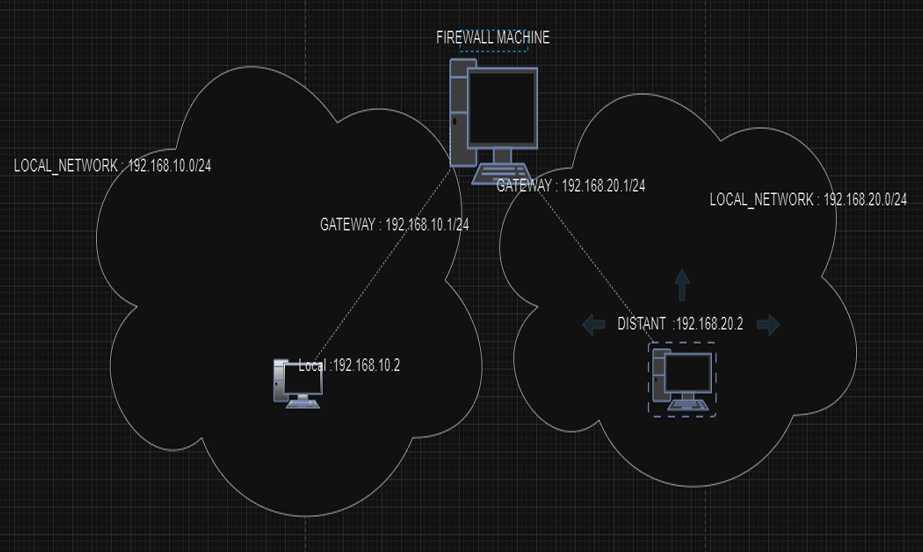
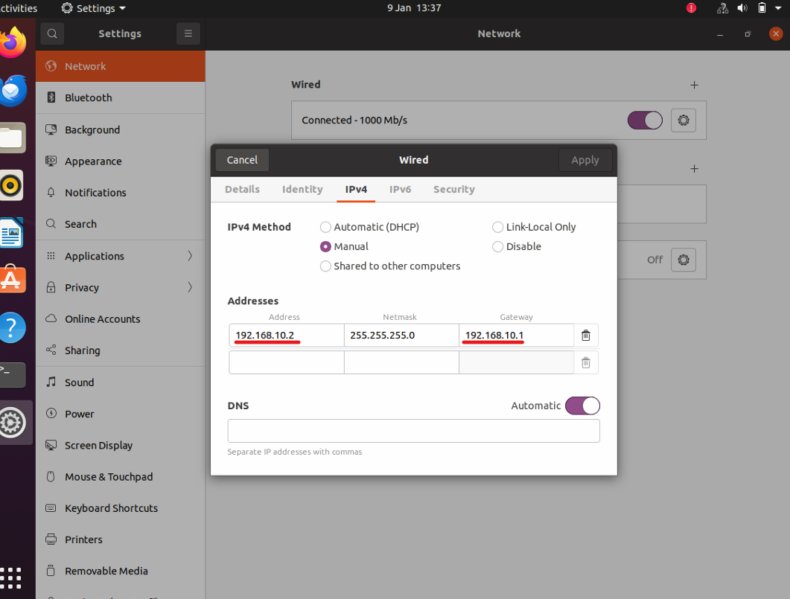

# Mise en place d'un firewall sous linux
## 1.L'architecture de Lab
Le lab contient 3 machines virtuelles utilisant [VirtualBox](https://www.virtualbox.org/). Les systèmes d'exploitation utilisés sont : deux machines sous [Ubuntu](https://releases.ubuntu.com/focal), qui joueront le rôle de machines normales, et la troisième sera une machine [Kali Linux](https://www.kali.org/), qui fera office de pare-feu.

## 2.Configuration de LAB
### A. Les machines normale sur le reseau 
La configuration des machines normales se concentrera uniquement sur la configuration des adresses IP et le test de la connectivité entre elles.

### B. La machine Firewall
Quant à la configuration de la machine pare-feu, elle se concentrera sur la configuration des adresses IP des deux interfaces et l'activation de l'option ip_forward. Cela permet à la machine de faire office de routeur en transférant les paquets entre les réseaux connectés à ses différentes interfaces.
## 3.Test de connectivité
L'étape suivante consiste à tester la connectivité en utilisant la commande ping et à essayer de tester différents protocoles comme FTP, HTTP, ICMP, etc.
## 4.Configuration de Firewall iptables
Les étapes de la configuration du pare-feu iptables sont :

1.Installer iptables

    sudo apt-get update
    sudo apt-get upgrade
    sudo apt-get install iptables

2.Configurer les règles iptables
### A.Exemples de syntaxe des règles iptables :

1.Bloquer tout le trafic entrant sauf SSH (port 22) :

    sudo iptables -P INPUT DROP
    sudo iptables -A INPUT -p tcp --dport 22 -j ACCEPT
2.Autoriser les connexions sortantes :
    
    sudo iptables -P OUTPUT ACCEPT

3.Bloquer une adresse IP spécifique :

    sudo iptables -A INPUT -s 192.168.1.100 -j DROP
4.Autoriser le trafic HTTP (port 80) et HTTPS (port 443) :

    sudo iptables -A INPUT -p tcp --dport 80 -j ACCEPT
    sudo iptables -A INPUT -p tcp --dport 443 -j ACCEPT
5.Autoriser le ping (ICMP) :

    sudo iptables -A INPUT -p icmp -j ACCEPT

## 5.Test du fonctionnement des protocoles et sauvegarde les configurations
### A.Test du fonctionnement :
Il faut tester les règles pour vérifier si elles fonctionnent avec le lab que nous avons créé.
Après avoir configuré les règles iptables, tu peux tester leur fonctionnement en faisant les actions suivantes dans ton lab :

1.***Tester la connectivité*** en utilisant la commande ping depuis l'une des machines Ubuntu vers l'autre ou vers la machine pare-feu.

    ping 192.168.x.x  # Adresse IP de la machine cible
2.***Vérifier les services*** comme SSH, HTTP, ou FTP en tentant d'accéder aux ports correspondants (22, 80, 21).

    ssh user@192.168.x.x  # Pour tester SSH
    curl http://192.168.x.x  # Pour tester HTTP
3.***Vérifier le blocage*** des adresses IP ou des protocoles bloqués en essayant d'accéder aux services qui devraient être interdits. 
### B.Tests de sauvegarde et de restauration de la configuration

1.Sauvegarde de la configuration iptables :

 Utilisez ***iptables-save*** pour sauvegarder la configuration dans un fichier :

    sudo iptables-save > iptables_backup.conf
2.Restauration de la configuration iptables :

    sudo iptables-restore < iptables_backup.conf
3.Vérification de la restauration :
Utiliser cette commande pour verifie:
    
    sudo iptables -L 
